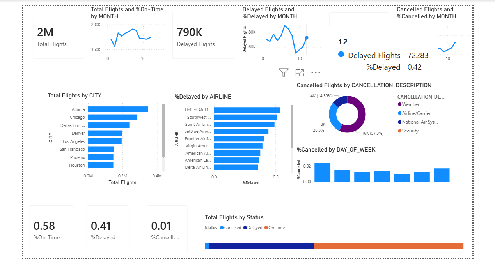

# Airline-Performance-Powerbi
This project focuses on analyzing airline flight operations using Power BI to uncover trends in on-time performance, delays, and cancellations. The dashboard provides a comprehensive view of flight activity across months, cities, and airlines, enabling data-driven insights into operational efficiency.

## 📷 Dashboard Preview

### Overview

### Monthly Performance

### Cancellations

